Top Ordinal Collections (Market Data Snapshot)

# Ordinals (Pixel Art) Sandbox (& Cache)

New to Ordinals?
See the talk notes titled
[**Inside Ordinal Inscriptions - Turn the Blockchain Into A Database For Digital Artefacts »**](insideordinals)

 o o o

Yes, you can!
Start your own
sandbox (& cache) or "right-clicker" ordinal backup / archive / gallery.
For a step-by-step guide and more see
the [**ordbase package (with the ordbase command-line tool) »**](https://github.com/ordbase/ordbase/tree/master/ordbase)

**100 Ordinal Punks (24×24)**  from #407 to #642 (Jan/31st+Feb/1st - 2d)

- from #407 to #642 (min. to max.)
     - <1000 => 100
- format(s)
     - image/png => 100
- day(s)
     - 2023-01-31 => 27
     - 2023-02-01 => 73

New to Ordinal Punks? For some background see [**Awesome 100 Ordinal Punks (Anno 2023) Notes - 24×24 Pixel Art on the (Bitcoin) Blockchain »**](https://github.com/ordinalpunks/awesome-ordinalpunks)

**100 (+1) Ordinal Phunks (24×24)**  from #74010 to #139687 (Feb/13th-18th - 6d)

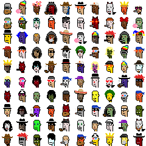

- from #74010 to #139687 (min. to max.)
     - <100000 => 4
     - <1000000 => 97
- format(s)
     - image/png => 101
- day(s)
     - 2023-02-13 => 3
     - 2023-02-14 => 1
     - 2023-02-15 => 1
     - 2023-02-16 => 3
     - 2023-02-17 => 12
     - 2023-02-18 => 81

**100 (+1) Lil' Ordinal Phunks (24×24)** from #14343 to #42901 (Feb/22th-26th - 3d)   _on Litecoin_

- from #14343 to #42901 (min. to max.)
     - <100000 => 101
- format(s)
     - image/png => 101
- day(s)
     - 2023-02-22 => 10
     - 2023-02-25 => 17
     - 2023-02-26 => 74

**69 Hoodie Gang (24×24)**

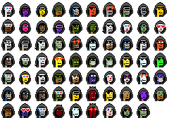

**100 Bitcoin Punks (24×24)**  from #1156 to #5535 (Feb/3rd-6th - 4d)

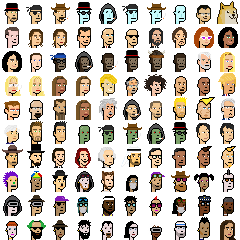

- from #1156 to #5535 (min. to max.)
     - <10000 => 100
- format(s)
     - image/jpeg => 100
- day(s)
     - 2023-02-03 => 42
     - 2023-02-04 => 11
     - 2023-02-05 => 32
     - 2023-02-06 => 15

**100 Taproot Punks (24×24)**

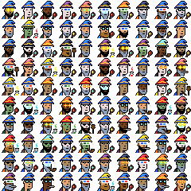

**88 G-Punks (24×24)**

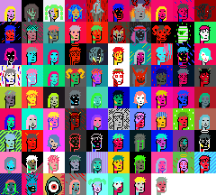

**80 Forgotten Punks (24×24)**

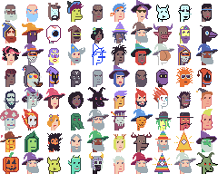

**50 Ordinal Hero Punks (24×24)**

**100 Litecoin Punks (24×24)**  from #642 to #834 (Feb/21st - 1d)   _on Litecoin_

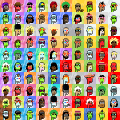

- from #642 to #834 (min. to max.)
     - <1000 => 100
- format(s)
     - image/png => 100
- day(s)
     - 2023-02-21 => 100

**98 (of 100) Punks Lite (24×24)**

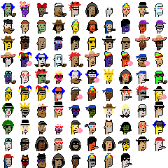

**50 Cyber Ordinals (24×24)**

**100 Ordinal Umeko Punks (24×24)**

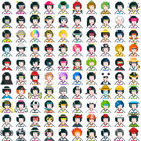

**150 Ordinal Insiders (24×24)**

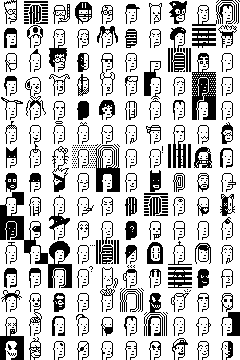

**100 Ordinary Apes (24×24)**

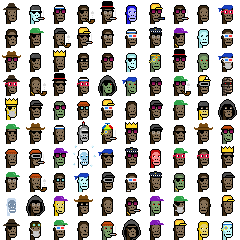

***100 Toshians (24×24)**

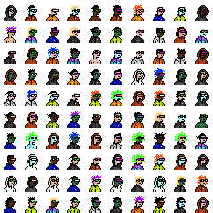

**100 Engraved Dragons (24×24)**

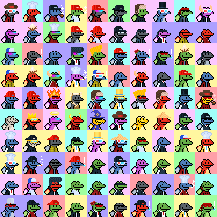

***111 of (???) Pixel Pepes (24×24)**

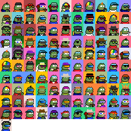

**100 Ordinal Mini Doges (24×24)**

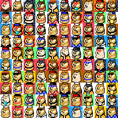

**200 Frenless (26×26)**

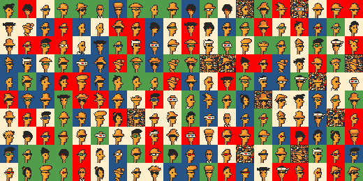

**69 Doge Punks (28×28)**

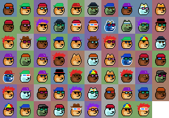

**111 Yeti Bit Club (28×28)**

**130 Shadow Smokers (30×30)**

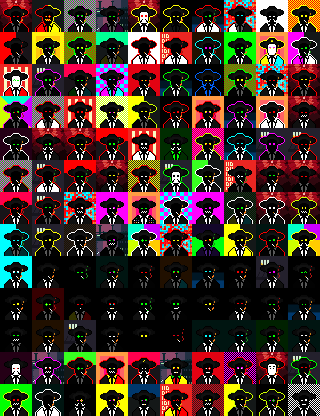

**40 Right-Click Inscribe (32×32)**

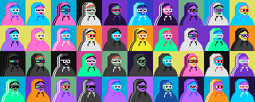

**20 Ordinary People (32×32)**

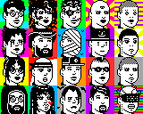

**111 Extra Ordinal Women (32×32)**

**100 Ordinal Goros (32×32)**

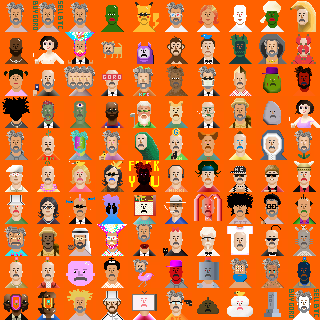

**69 (Skull) 1337 Ordinals (32×32)**  - from #8440 to #10778  (Feb/6th+7th - 2d)

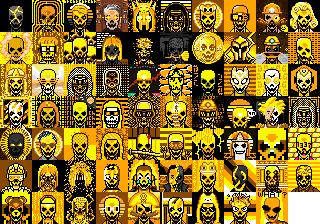

**111 Hidden Society (32×32)**

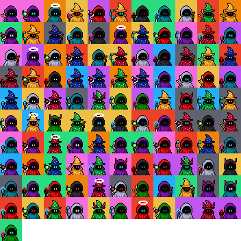

**100 (+1) Ordoggies (32×32)**    _on Dogecoin_

**100 Ordinal Penguins (35×35)**

**100 Ordinal Doge (36×36)**

**512 Bitcoin Bandits (36×36)**

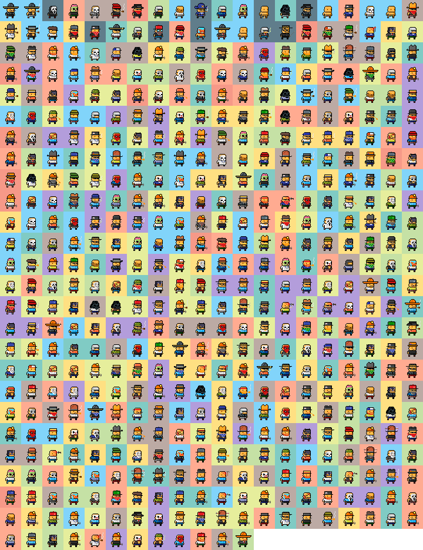

**12 Ordinal Gold Birds (42×42)**

**100 Ordinal Birds (42×42)**

**100 Ordinal Kitties (45×45)**

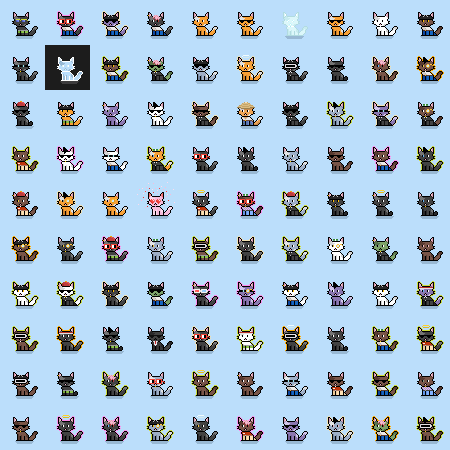

**100 Bitcoin Bears (48×48)**

**10 Shadow Hats (50×50)**

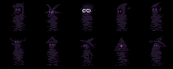

**100 Ordi(nal) Doodles (50×50)**

**100 Ordinal Waifus (50×50)**

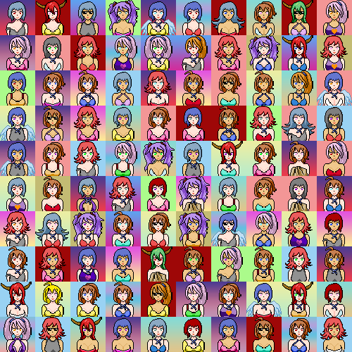

**100 Ordinal Primates (50×50)**

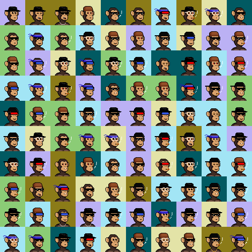

**100 Bitcoin Apes (50×50)**   from #646 to #5943  (Feb/1st-6th - 5d)

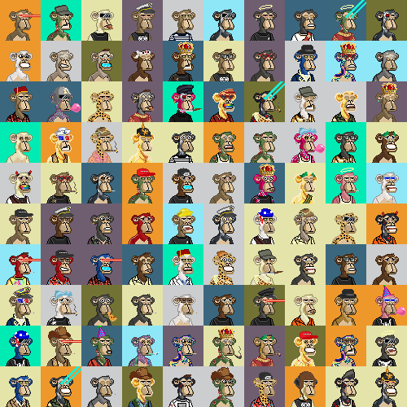

**100 Ordinal Minis (50×50)**

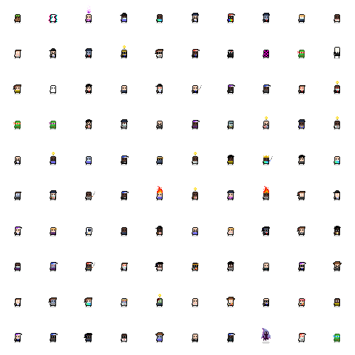

**10 Elders Of Crypto (64×64)**

**69 Inscibed Pepes (64×64)**

**99 Bitcoin Goblins (68×68)**

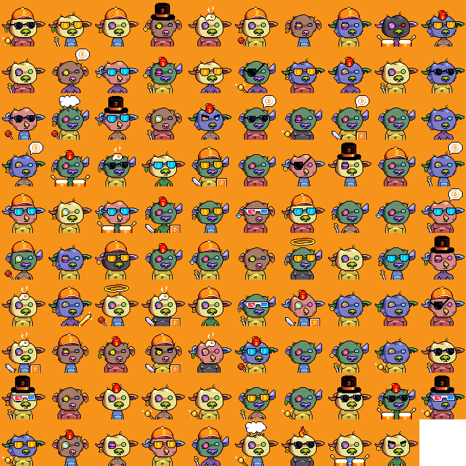

**20 (of 80) Pop Ordinal Cats (100×100)**

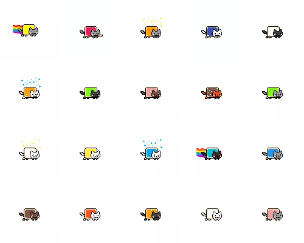

## Questions? Comments?

Post them over at the [Help & Support](https://github.com/geraldb/help) page. Thanks.

